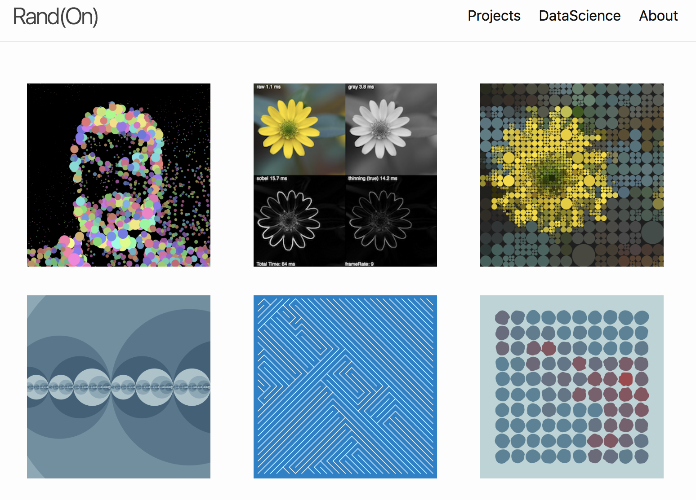

# Portfolio

https://www.rand-on.com/



This site was created using a template for jekyll: [demo](https://benjaminhabert.github.io/jekyll-p5-portfolio/), [source code](https://github.com/BenjaminHabert/jekyll-p5-portfolio).

## Development

My setup is MacOS 10.13.2

- install [homebrew](https://brew.sh/)
- install [ruby with homebrew](https://jekyllrb.com/docs/installation/#homebrew)
- install [jekyll](https://jekyllrb.com/docs/installation/#set-up-ruby-included-with-the-os):

```
$ gem install bundler jekyll
```

- start development:

```
$ git clone git@github.com:BenjaminHabert/rand-on.git
$ cd rand-on
# only run once:
$ bundle install
# run each time:
$ bundle exec jekyll serve
# alternatively:
$ make serve
```
