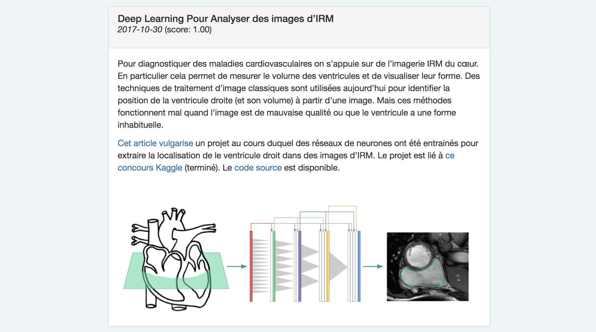

I created a **[Newsletter Website](https://benjaminhabert.github.io/newsletter/)**
([github repo](https://github.com/BenjaminHabert/newsletter)) for internal use in my company.

This article will explain why and how I built the website. The most interesting part of this project
is described at the end: how to **implement a crude searchable list of articles** using
[TF-IDF](https://en.wikipedia.org/wiki/Tf%E2%80%93idf) so that the most relevant articles are first.

## Why ?

I joined [Quantmetry](https://www.quantmetry.com/) in mid-2015. We were only 15 at the time. Soon after
I decided to send to other team members a technical newsletter every few weeks containing interesting
articles / tutorials found on the web. These were only word documents that we would share over e-mail.

Unefortunately the newsletters were mostly useful to me: I would sometimes go back to find a resource for a particular
project I would be working on. It was easy for my as I had all the documents archived on my computer.
However for others this would require tedious sifting of their inbox. Consequently I decided to
migrate the content of all these word documents to the web to make them more accessible. It was also
an oportunity for learning some basic web dev.

## Requirements

- the following newsletter will still be written as word documents
- adding new content to the website once a new document is written should not require any effort
- the website itself must not be complicated (I didn't know a lot about web development at the time)
- the website must consist of a list of items that can be searched

## Building the website

The content of the website (articles and images) is rather small. The articles of the newsletter
are composed of
1. text and metadata: all the articles are saved in a Json file
2. images: they are saved on there own. At the moment there are about 100 images totaling 42 Mb.

Consequently I decided not to use a database: all the content is stored alongside the website which
is hosted by [github-pages](https://pages.github.com/).


### Step 1: extracting content from the documents

Text, images, links and metadata are extracted from the word documents with a Python script. First,
using [mammoth](https://pypi.python.org/pypi/mammoth) the document is converted to an html string.
Then the HTML is parsed using a few regular expressions to split the page in several articles.

I seem to remember that I also tried the package [python-docx](https://python-docx.readthedocs.io/en/latest/)
or [docx](https://pypi.python.org/pypi/docx) but mammoth was more convienent in the way it handles
images. This allowed me to save the images as png in a different folder.

The result of this first step is a few python files that allow me to convert a group a word documents
to a folder of images and a json file containing the text of each article. The format is the following

```javascript
[
    {
        images: ['8U8373.png', ...],
        article: '<p>Content of the article</p>',
        title: 'Deep Learning with Keras',
        tags: [
            {tag: 'keras', importance: 3.213},
            {tag: 'python', importance: 1.32},
            ...
        ]
    },
    ...
]
```

The `tags` array is used to search the list of article; we will detail this later.

### Step 2: building the front-end

The website itself is very simple. It was built from the [Fountain Yeoman template](http://fountainjs.io/download/)
project. I used Angular 1 and only Bower for dependency management. The final source code can be [found
on github](https://github.com/BenjaminHabert/newsletter/tree/master/src/app).

The Angular application defines a `newsitem` component:

```HTML
<div class="panel panel-default">
  <div class="panel-heading">
    <h3 class="panel-title">{{itemData.title}}</h3>
    <p> <em>{{itemData.date}}</em> (score: {{itemData.relevance}}) </p>
  </div>
  <div class="panel-body" ng-bind-html="innerHTML">
  </div>
    
</div>
```

```javascript
angular
  .module('app')
  .directive('newsItem', function () {
    return {
      restrict: 'E',
      scope: {
        itemData: '=data'
      },
      controller: ['$scope', '$sce', newsItemController],
      templateUrl: 'app/newsitem/newsitem.html'
    };
  }
);

function newsItemController($scope, $sce) {
  $scope.innerHTML = $sce.trustAsHtml($scope.itemData.rawhtml);
  $scope.imagelist = $scope.itemData.images;
}
```

The rest of the code is just a search bar and a sorted list of `newsitem` elements. Here is how each `newsitem` is rendered:



With this simple setup, building the website when new word documents are available is easy:

```shell
$ python3 newsletter_builder/application/main.py
$ gulp build
# using this to deploy to github pages: https://www.npmjs.com/package/gulp-gh-pages
$ gulp deploy
```

## Implementing a search function

One of the requirements was to make the list of article searchable. Here is how I did it

1. While parsing the raw word documents, a list of words is associated to each article; we will refer
to them as **`tags`**. We remove from this list the tags that are too frequent (stop-words).
2. An *importance* is computed for each tag in each article. This imprtance is computed by using the
[TF-IDF](https://en.wikipedia.org/wiki/Tf%E2%80%93idf) method: the number of occurences of the tag
in the article is compared against the frequency of this tag in the whole corpus of articles. A tag
appearing in the title of the article is given a higher *importance*.
3. We save the list of all tags as a separate json file: this list will be used in the front-end
for auto-completion in the search bar.
4. When the user searches for a tag in the front-end, the articles are sorted using the *importance*
of this tag in each article.

Here is how the search function is implemented in javascript:

```javascript
function performSeach(search, news) {
  var searchArray = [];
  if (search) {
    searchArray = search.split(',').map(function (s) {
      return s.trim().toLowerCase();
    });
  }
  for (var i = 0; i < news.length; i++) {
    news[i].relevance = computeRelevance(searchArray, news[i]);
  }
  // only news item with non 0 relevance
  var selected = news.filter(function (element) {
    return element.relevance > 0;
  });
  // sort by relevance and time
  selected = selected.sort(function (a, b) {
    var comp = b.relevance - a.relevance;
    if (comp === 0) {
      if (a.date > b.date) {
        comp = -1;
      } else if (a.date < b.date) {
        comp = 1;
      }
    }
    return comp;
  });
  return selected;
}

function computeRelevance(searchArray, newsitem) {
  var tags = newsitem.tags || [];
  var relevance = 1;
  if (searchArray) {
    searchArray.forEach(function (searchWord) {
      var partialRelevance = 0;
      tags.forEach(function (item) {
        if (item.tag === searchWord) {
          partialRelevance += item.importance;
        }
      });
      relevance *= partialRelevance;
    });
  }
  return relevance.toFixed(2);
}
```
