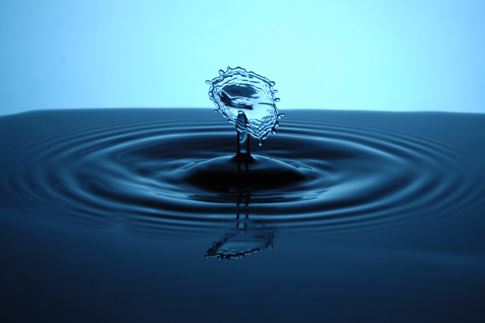
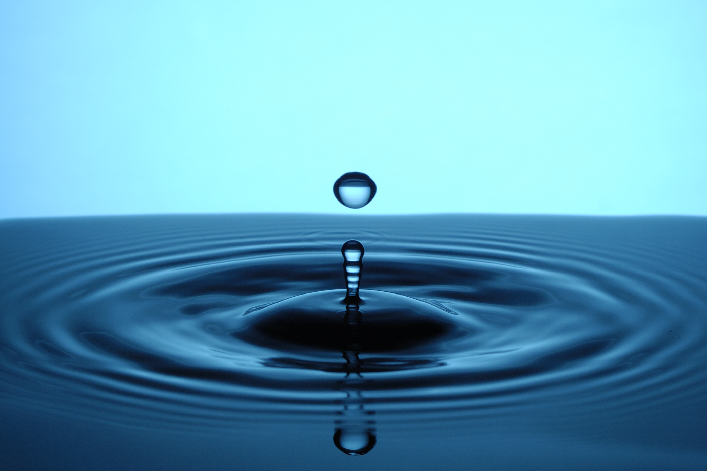

This photography project was done in collaboration with a friend: Baptiste Jayet.

This is a series of pictures of droplets falling in water; we captured the moment of impact.
The scene is illuminated from behind; a coloured plastic sheets is placed in front of
the flash. The pictures are taken with a low angle relative to the water surface in order to
obtain a sharp contrast for the ripples.

We encountered two technical challenges during this project:

1. We had to make sure the exposure duration was short enough
for the droplets to appear frozen in time. The camera used did not allow such a setting.
We decided to let the camera expose for a full second in a dark room. The flash was set to
a duration of a few milliseconds; this is what allowed short exposure.
2. We needed to trigger the flash *exactly* when the droplet touched the water surface.
This part was more tricky: we ended up building a small detection setup.

    - using a syringe we could create droplets in a reliable and consistant manner
    - a laser pointer was shined horizontally towards a photo-diode
    - when the droplet is falling, it momentarily interrupts the path of the laser light which no longer
        shines on the photo-diode
    - using an arduino, the photo-diode output is measured. When this output signal falls
        a trigger signal is sent to the flash and the picture is taken
    - By hocking up a variable resistor to the arduino we were able to tune the delay between the detection
        and the trigger.


