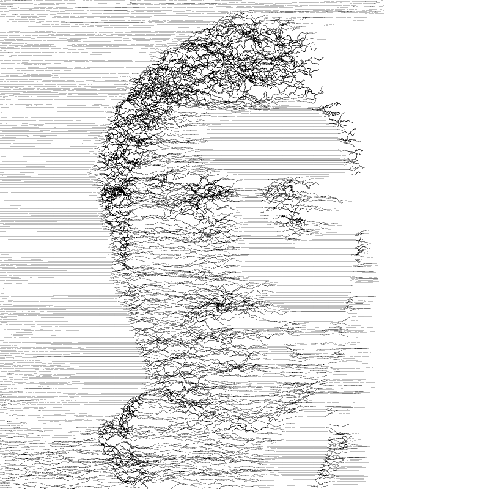

In these portaits I enjoy the visual effect of scale. Seen from far away facial features can be 
identified; seen in close-up the complex shapes of the lines overpower our ability to recognize a face. 

Also I find that the lines look somehow similar to writing. This could be a text describing the person; 
the text is fading away.

These portraits were generated using Processing. Lines are drawn from left to right over a source image: 
their thickness and curvature depend on the image local brightness. Unfortunately I lost the source code.

### Gallery

