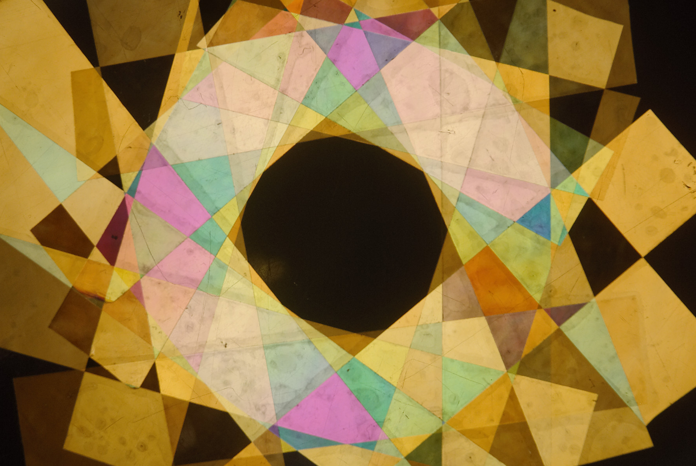
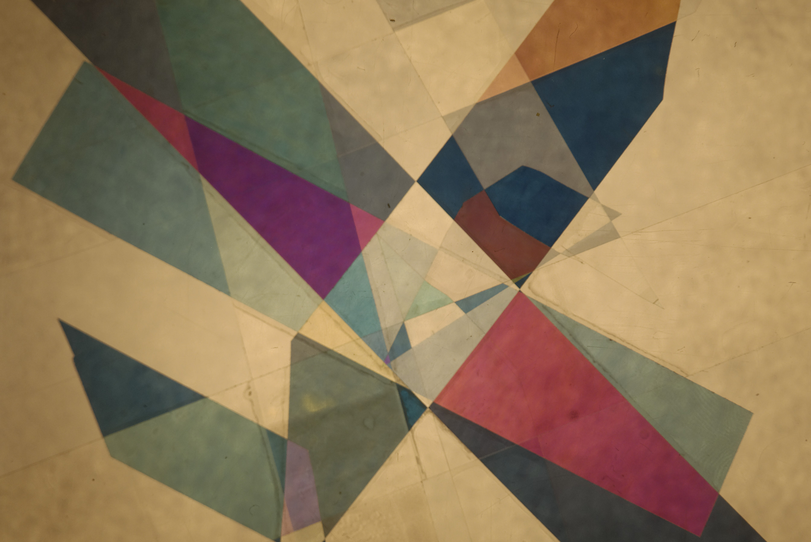

This photography project was done in collaboration with a friend: Baptiste Jayet.

This is a series of pictures demonstrating the variety of colours one can achieve
using polarisation - **no colour filter** was used during this project.

The basic setup is inspired by the technique of [polarised-light microscopy](https://www.microscopyu.com/techniques/polarized-light/polarized-light-microscopy);
it can for instance be used for the [analysis of crystals in stone](https://www.google.fr/search?biw=1600&bih=795&tbm=isch&sa=1&q=polarized+light+microscopy+stone&oq=polarized+light+microscopy+stone&gs_l=psy-ab.3...5887.6646.0.6765.6.6.0.0.0.0.68.318.6.6.0....0...1.1.64.psy-ab..0.1.56...0i19k1j0i30i19k1j0i5i30i19k1.3M7TsSQgSIs).

In this setup a white light is directed towards the camera. Between the two are placed:
 - a first linear polariser: this one is kept static
 - a transparent object: this is what we take pictures of. In our case this is simply
    transparent tape laid on regular glass.
 - another linear polariser: this one is rotated between shots.

Colour in such a configuration is the result of polarisation rotation induced by the object (the tape).

### dark and light


### playing with squares


### central symmetry


### overflowing colours

