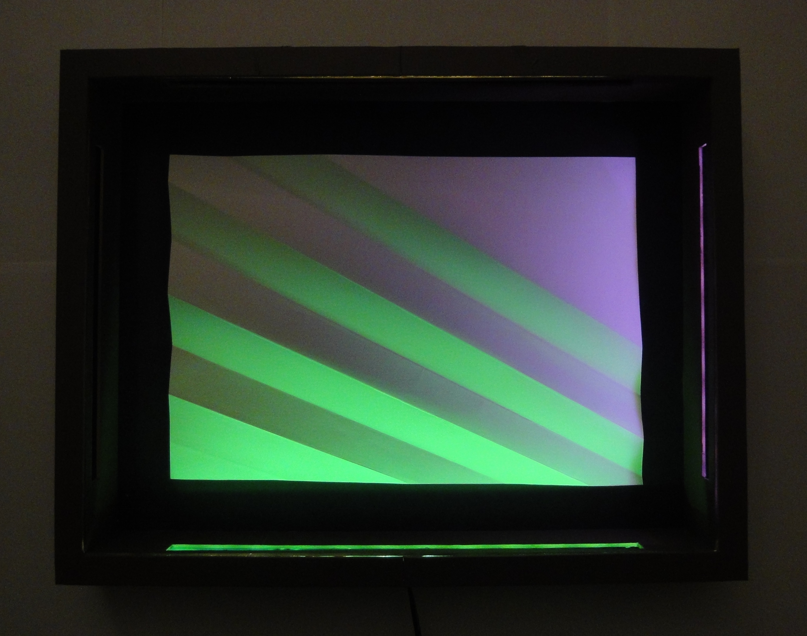
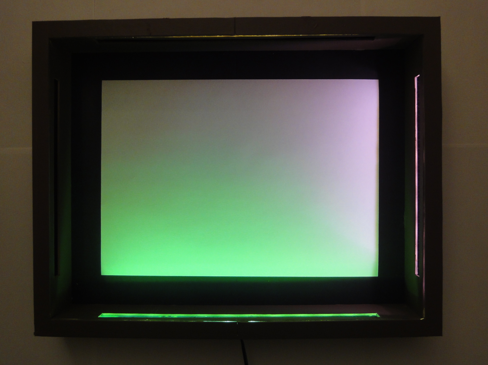

A blank sheet of regular print paper is positionned in the center of the frame. Lights are hidden in the 
frame edges and illuminate the paper from the sides with a grazing incidence. Color filters are placed 
in front of the lights. This results in a color gradient on the paper (see picture bellow for a flat 
sheet of paper). Because the paper is slightly folded, different regions are more or less exposed to the 
light: the paper appears to change color between folds.

### Gallery

It is easy to change to color filters, the sides illumination is coming from or the shape of the paper folds. This allows for a lot of variation in the resulting design.



