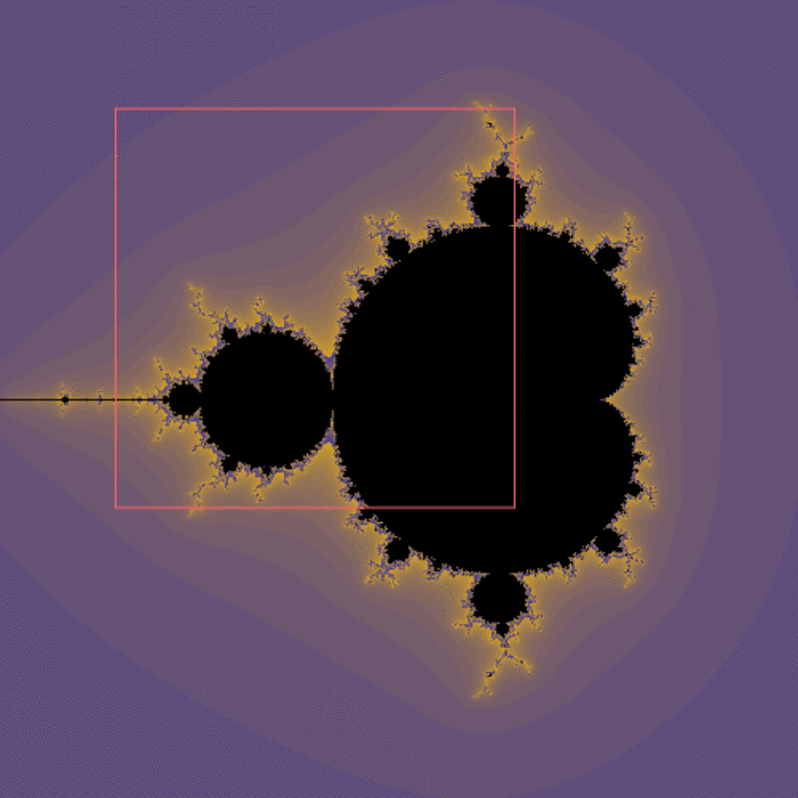

Click on the image to zoom in the [Mandelbrot set](https://en.wikipedia.org/wiki/Mandelbrot_set). Double-click to reset.



I decided to implement my own version after watching [one of Daniel Shiffmann's
videos](https://www.youtube.com/watch?v=pLtViSqkPvQ).



