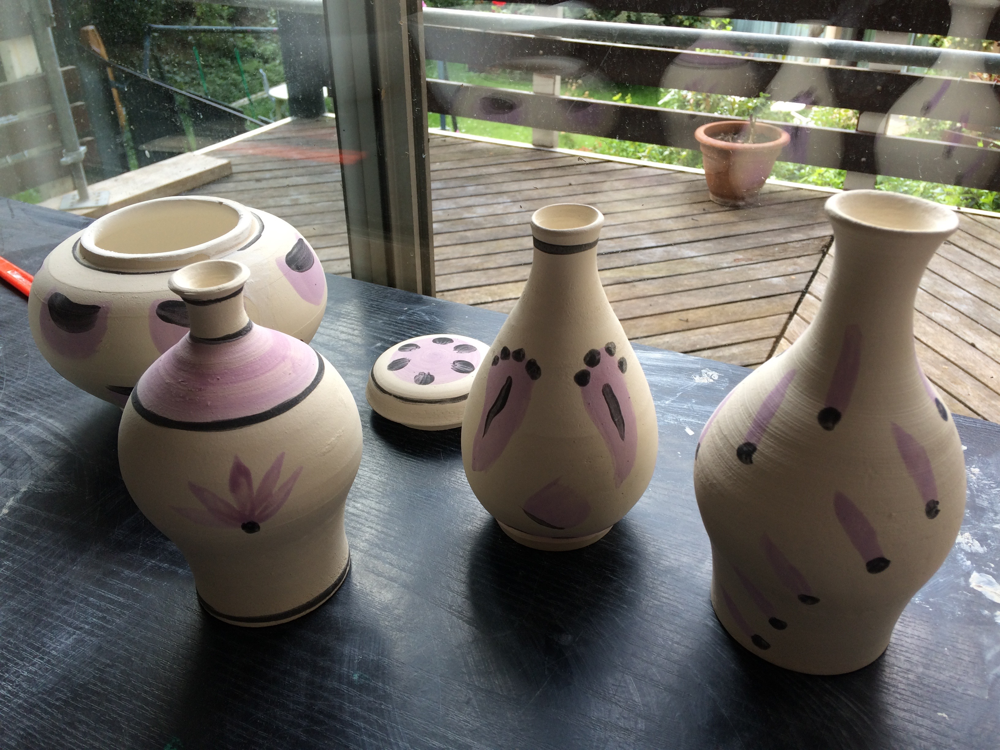

I have been doing pottery on and off in the past few years. I rarely take pictures
of my (very) amateur work. I photographed these small vases in the different stages
of the process.

In 2016 I had the opportunity to take private lessons with [Juliette Tiberghein](http://www.artistes-meudon.fr/html/Juliette%20Tiberghien) in
here home studio. It was my first time using a kick wheel instead of an electric one.


