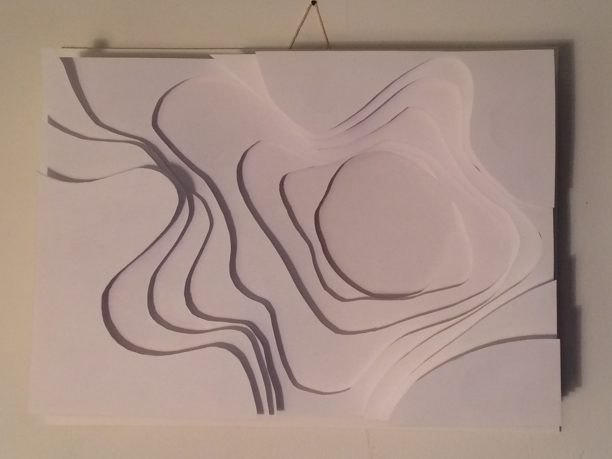

Regular A4 printer paper; cut and stacked.

To me this looks like a topographic map of a sedimentary landscape. I am not sure
how erosion would create such a shape though.

[Bianca Chang](http://biancachang.com/) pushes this idea much further both technically
and aesthetically.


