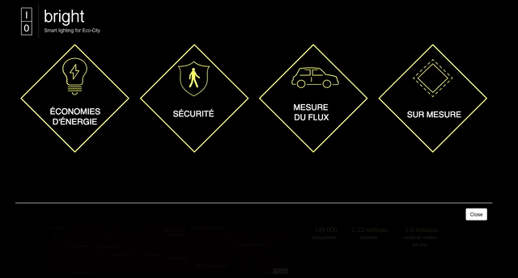
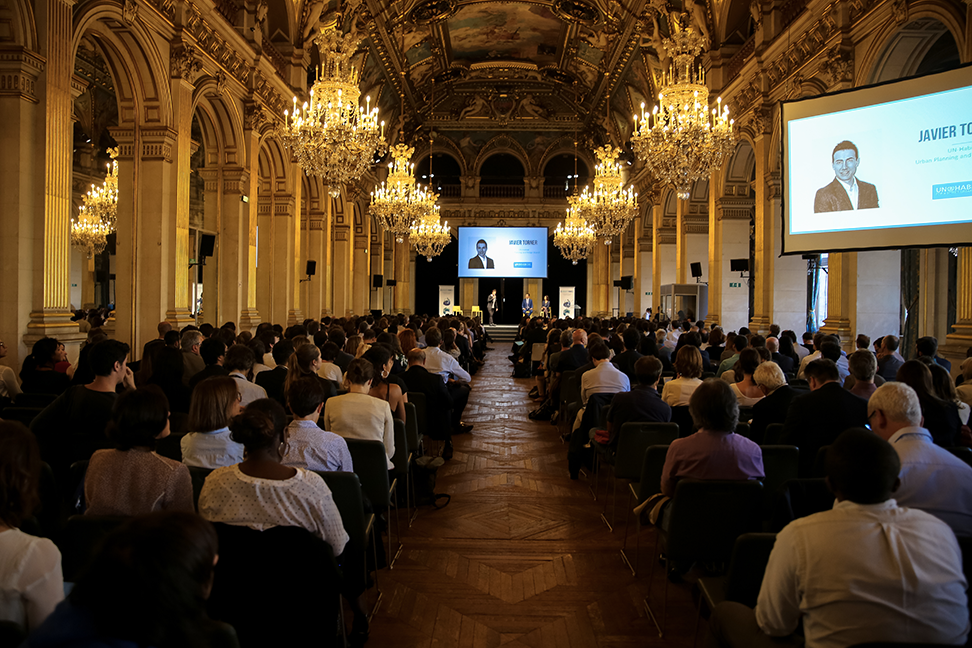

Visit the **[live website](https://benjaminhabert.github.io/datacity/)** / see the
[source code](https://github.com/BenjaminHabert/datacity).

In this project, we estimated how much energy could be saved yearly by the city of Paris by
adapting the street lighting to the actual traffic.

## Context

[Numa](https://datacity.numa.co/paris/) organized a
[series of challenges](https://datacity.numa.co/paris/challenges/saison-2/) with the city of Paris.
The challenge I took part in was called [Intelligent Street Lighting](https://datacity.numa.co/paris/solutions/eclairage-adaptatif/): **in order to save energy,
how can we adapt public lighting to the citizens' need?**. More specificaly the objective was to
measure how much can be saved by dimming the streets lighting in the middle of night when traffic is low.

Paritipating to this challenge were
[Bouygues ES](https://www.bouygues-es.fr/liste-actualite/seconde-edition-datacity-paris),
SFR, EVESA, Quantmetry and Dataiku. The challenge took place over **2 weeks** in April 2017.
The results were presented at Paris City Hall in June 2017.

## Work done

1. The first step was to **measure the average traffic** in the night. We used data provided by
the mobile service prodider SFR: aggregated counts of mobile users by area (IRIS) over time.
Data privacy issues imposed that we use only an aggregated dataset rather than idividual users'
position.
2. Choosing a **dimming scenario**. This was done in collaboration with EVESA who operates the public
lighting in Paris. We used a dataset containing all the lamps in Paris. Several criteria were used:
    - pedistrian-only areas remain fully lit
    - only certain kinds of lamps can be dimmed (technical limitation)
    - the lamps are dimmed to 70% of their maximum power during the low-traffic period in the night
    (when traffic is lower than 5% of its maximum).
3. Showing the result of the dimming scenario in a simple **[web-interface](https://benjaminhabert.github.io/datacity/)**

Overall we estimated that the proposed dimming scenario would provide a **yearly energy saving of
about 5% or 700 000 €**.

The technical tools used were:
- Dataiku's [Datascience Studio](https://www.dataiku.com/dss/features/connectivity/) plateform
where we ran Python and SQL scripts (with [PostGIS pluggin](https://postgis.net/)) for data preparation,
- [D3.js](https://d3js.org/) and [leaflet](http://leafletjs.com/) to show the results in a simple web interface.

## Talk

Appart from the final pitch at Paris City Hall in June 2017, I was also invited by *[Les Mardis de
l'innovation](http://mardis-innovation.fr/events/seance-du-mardi-18-avril-2017-la-ville-de-demain-sinvente-aujourdhui/)*
to present the project and the methodology used. Here is the talk itself (in French):

<iframe src="https://player.vimeo.com/video/214217344" width="640" height="360" frameborder="0" webkitallowfullscreen mozallowfullscreen allowfullscreen></iframe>

<a href="https://vimeo.com/214217344">La ville de demain - Benjamin Habert</a> from <a href="https://vimeo.com/user5725972">Mardis de l&#039;innovation</a> on <a href="https://vimeo.com">Vimeo</a>.

