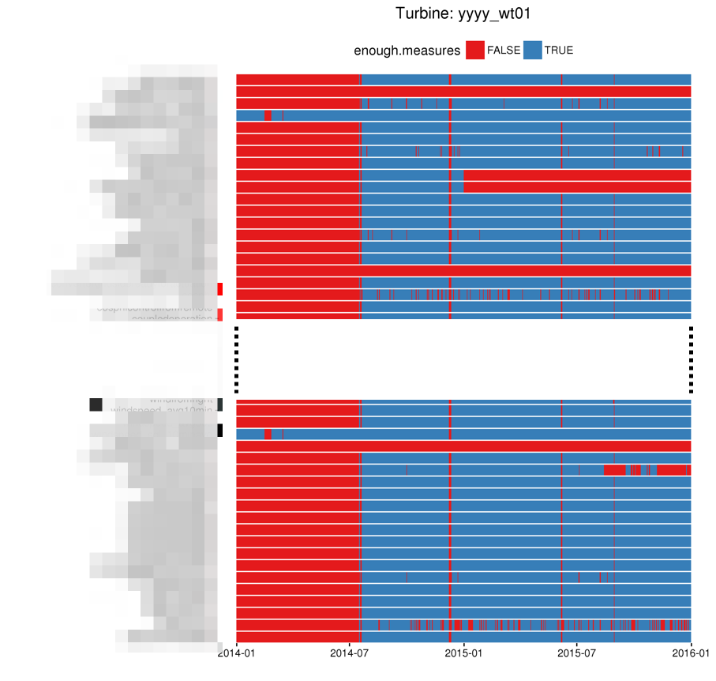
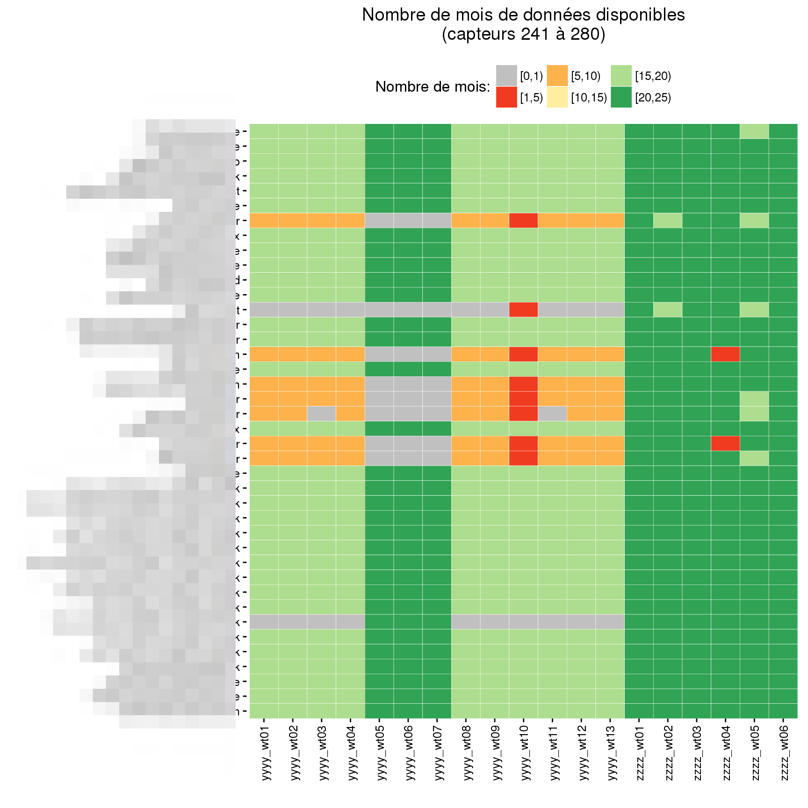
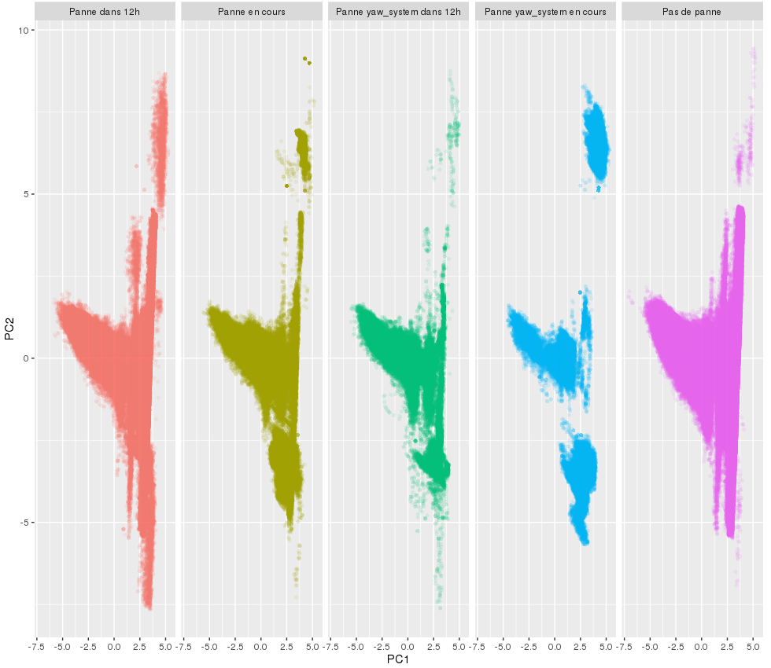

My client for this project is operating wind turbine farms. We wondered if it was possible to use
data generated by the wind turbine in order to predict the occurrence of a failure.

Although I cannot share much information about the project itself I wanted to show some plots generated
with [ggplot2](http://ggplot2.org/). I am not very familiar with R and it was my first time using it extensively.

Most of the work was to measure the availability of each data source (more that 200 sensors per
turbine).

This first step allowed us to descriminate between sensors the one that we could use reliably.
A first level of analysis was then to compare in a projected feature space (PCA) wind turbines with and
without failures.

Unfortunately I cannot share anymore details on this project.
