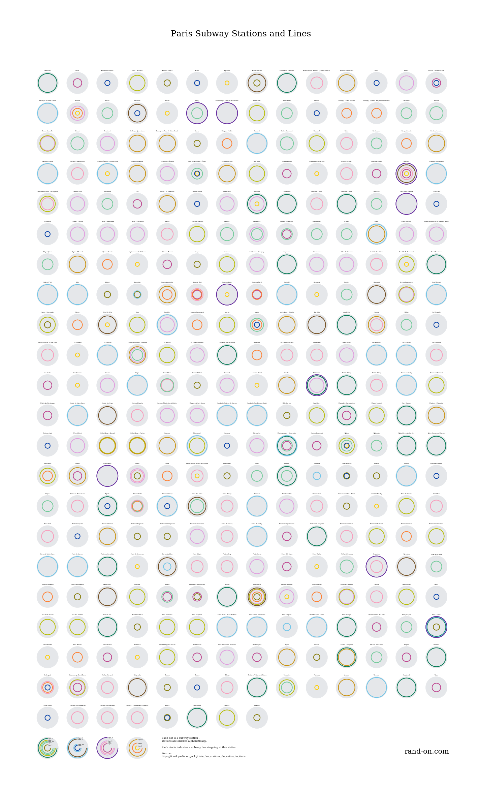
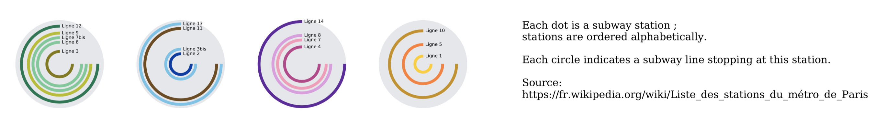

This small-multiple dataviz represents the subway network in Paris. Each dot
is a station. Each circle indicates that a given subway line stops at this station.
Lines are shown with their official colors. Radius is proportional to the
line number. Here is the [pdf version](stations.pdf) of this image.

### Legend details

### Tools

You can use the code available in
[this repository](https://github.com/BenjaminHabert/Paris_Subway_Dataviz)
if you want to generate the image yourself.

This image was generated with Python using the tools of the
[pydata](https://pydata.org/downloads.html) ecosystem:

- [Beautiful Soup](https://www.crummy.com/software/BeautifulSoup/bs4/doc/)
was used to download the raw data from wikipedia:
  - [list](https://fr.wikipedia.org/wiki/Liste_des_stations_du_m%C3%A9tro_de_Paris)
  of subway stations and lines
  - official color of lines are found by looking at their [respective wikipedia
  pages](https://fr.wikipedia.org/wiki/Ligne_12_du_m%C3%A9tro_de_Paris)
- a bit of post-processing was done in [Pandas](https://pandas.pydata.org/)
- the image itself was generated with [matplotlib](https://matplotlib.org/)
and [seaborn](https://seaborn.pydata.org/index.html)

### Notes about the process

Using `requests` and `beautifulsoup`, it was relatively straightforward to
retrieve the data. However there is a lot a fiddling because of the way the
original html is structured (invisible spaces,
info in `title` attribute rather than in `
`). This makes the process
hard to reproduce on another data source.

`matplotlib` and `seaborn` are convenient as I know their APIs quite well at
this point. However these tools make it difficult to be extremely precise
on legend or label position. Most of the confusion comes from the use of
several scaling unit: axes scale, figure relative coordinates, figure coordinate
in inches, fontsize. I think a more generic drawing tool
([`pycairo`](https://pycairo.readthedocs.io/en/latest/) ?) would be more suitable
for this kind of visualization.

#### Making the legend

As usual, making the legend required as much time as the rest of the whole project.

I decided to represent the subway lines in the legend in exactly the same
way they are drawn in the actual visualization (instead of creating a
vertical list of `color` - `line name` association which would be a more
standard way of doing it). I think this decision allows the viewer to identify
a given line more easily.

Showing all the lines on a single station would result
in a crowded legend with labels overlapping one another. Consequently
I decided to split the legend in four parts of roughly similar colors.
